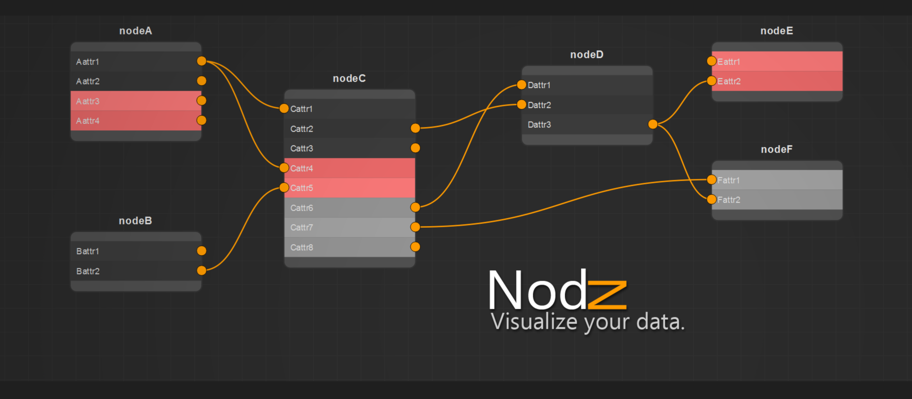

Nodz is a very user friendly python library to create nodes based graphs. It can be connected to anything you want as long as it understands python. Nodz does not hold any data other than its own graphics and attributes types as it is used by the graphics.
Nods provides you with a very simple way to read your graph, it outputs connections as strings ('Node1.attribute1', 'node2.attribute5')

Nodz is partially customizable via a configuration file that let you change colors and the shape of nodes.


***If you find any errors/bugs/flaws or anything bad, feel free to let me know so I can fix it for the next persons that would like to download nodz.***

Nodz in under the [MIT license](LICENSE.txt).

[WATCH DEMO HERE](https://vimeo.com/219933604)


###
## Prerequisite
- Python
- pyQt4 or pyQt5 or pySide or pySide2
- [Qt.py](https://fredrikaverpil.github.io/2016/07/25/developing-with-qt-py/)

Nodz needs to be in a PYTHONPATH.

**Qt.py is very important as Nodz is based on it in order to work for multiple versions of Qt.**  
Short and easy story for lazy peeps. :smile:   [This file](https://raw.githubusercontent.com/mottosso/Qt.py/master/Qt.py) has to be available within a PYTHONPATH.  


###
## Configuration file

Nodz comes with a default [configuration file](default_config.json), it is specified what can be removed and what can't be.  
If this file stays in the default location, it is auto loaded BUT you still need to apply it to Nodz (look at [nodz_demo.py](nodz_demo.py) lines 5/6)  
Be careful when editing it, if you are missing a "**,**" it will error. So don't screw up. :smile: 


###
## Features

Nodz comes by default with few features, you can toggle the grid visibility and the auto snap mode + some hotkeys. Hotkeys are at the moment based on Autodesk Maya because I developped this library for my personnal use in this specific software but I'm planning on adding that part in the configuration file so everyone can set different hotkeys.

```python
nodz.gridVisToggle = True
nodz.gridSnapToggle = False
```

```
del : delete the selected nodes
f   : zoom focus on selected items, all the items if nothing is selected
s   : snap the selected node on the grid

```


###
## API

Nodz has a very simple API of 12 methods.
For more information on each method, please read [nodz_main.py](nodz_main.py) as it has all the documentation required.

Initialize
```python
def loadConfig(filePath=defautConfigPath)
def initialize()
```
Nodes
```python
def createNode(name, preset, position, alternate)
def deleteNode(node)
def editNode(node, newName)
```
Attributes
```python
def createAttribute(node, name, index, preset, plug, socket, dataType)
def deleteAttribute(node, index)
def editAttribute( node, index, newName, newIndex)
```
Graph
```python
def saveGraph(filePath)
def loadGraph(filePath)
def evaluateGraph()
def clearGraph()
```

###
## Signals

Nodz also offers you some signals, most of them can feel redundant considering the design of the library but I'm sure some of you will find a use for it. It's better to have them just in case than not having them.   
**They are absolutly not mandatory in order for nodz to work.**

Nodes
```python
signal_NodeCreated(nodeName)
signal_NodeDeleted([nodeNames])
signal_NodeEdited(oldName, newName)
signal_NodeSelected([nodeNames])
```
Attributes
```Python
signal_AttrCreated(nodeName, attrIndex)
signal_AttrDeleted(nodeName, attrIndex)
signal_AttrEdited(nodeName, oldIndex, newIndex)
```
Graph
```python
signal_GraphSaved()
signal_GraphLoaded()
signal_GraphCleared()
```
View
```Python
signal_KeyPressed(key)
signal_Dropped(drop position)
```

